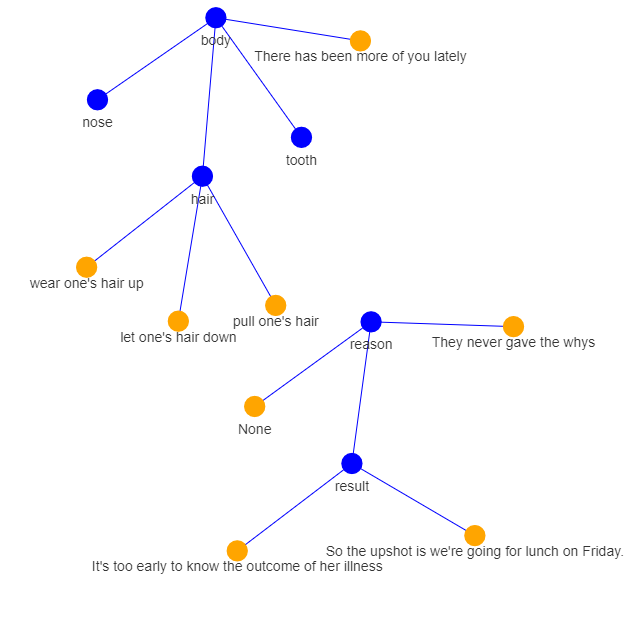

# PVOGraph

## Hướng dẫn sử dụng:
- Tải tệp [PVOGraph001.zip](https://drive.google.com/file/d/1i-EujvvoK6XIwRPtlhxsbw9PjcnBMtoo/view?usp=sharing)
- Giải nén tệp `PVOGraph001.zip`. Ta sẽ nhận được một thư mục `graph`, lưu ý thư mục này có thể nằm trong một thư mục tên `PVOGraph001`
- Tìm tệp `Default.mdb` trong thư mục `PVO/Database/Default`, rồi copy tệp này vào thư mục `graph`
- Nhấn đúp chuột vào tệp `graph.exe`
- Nhập các thông tin sau (sau mỗi thông tin gõ Enter):
  - Tên file .mdb (`Default.mdb`)
  - Các concept cần hiển thị, cách nhau bằng dấu "," không kèm theo khoảng trắng (ví dụ: body,reason)
  - Các quan hệ giữa hai concept cần hiển thị. Ta gõ số thứ tự của các concept được chọn, cách nhau bằng dấu "," (ví dụ: 1,2,3)
  - Các quan hệ giữa concept-example cần hiển thị. Ta gõ số thứ tự của các concept được chọn, cách nhau bằng dấu "," (ví dụ: 1,2,3)
- Mỗi lần dùng PVO lưu thêm từ, nhớ copy lại tệp `Default.mdb` vào thư mục `graph`
- Để lưu đồ thị dưới dạng ảnh, bạn có thể nhấn phải chuột vào màn hình đồ thị rồi chọn `Save`.

## Hình ảnh minh họa

